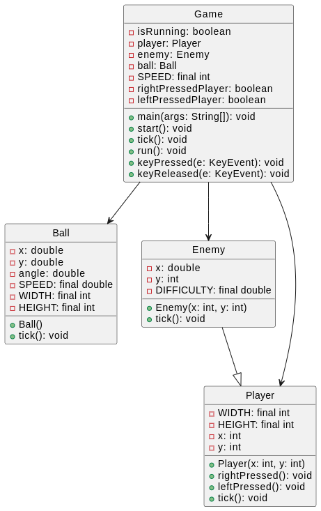
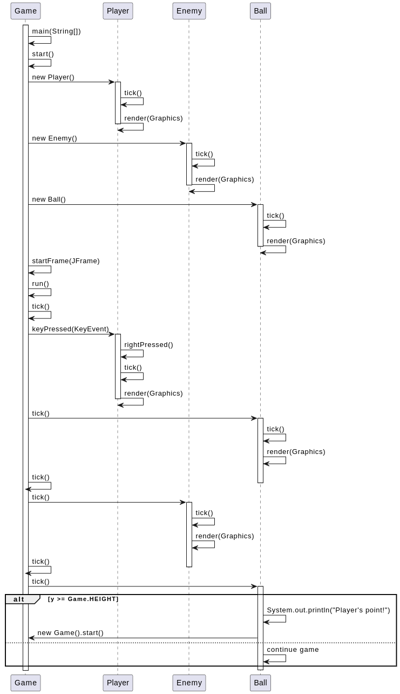

# Pong

Trabajo Practico Ingenieria de Software - FCEFyN

## Integrantes

- Bevilacqua, Francisco
- Gil Cernich, Manuel
- Cisneros, Tomás
- Potinski, Mijail

---

## Requisitos

- Java Development Kit (JDK) 8 o superior.
- IDE de Java para compilar y ejecutar el proyecto.

## Ejecución

1. Clona el repositorio.
2. Abre el proyecto en tu IDE.
3. Ejecuta el archivo `Game.java` para iniciar el juego.

## Descripcion
Pong es un juego de arcade clásico en el que dos jugadores controlan paletas en los extremos de la pantalla y tratan de golpear una pelota hacia el lado opuesto para anotar puntos. 

- Utiliza las teclas de flecha izquierda y derecha para mover la paleta.
- La paleta del enemigo se mueve automáticamente con un nivel de dificultad determinado.

---

   
  <em>Fig 1. Diagrama de clases.</em>

---

   
  <em>Fig 2. Ejemplo de ejecucion.</em>

---

## Anexo

- [Drive del grupo](https://drive.google.com/drive/folders/1aoHKunj3fMuHrh10rXfOI_m_sZGkhvHD?usp=sharing)
- [Repositorio idea original](https://github.com/diegolrs/Pong)
